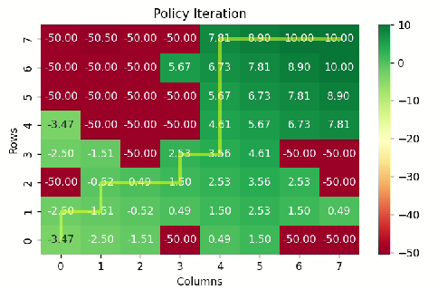
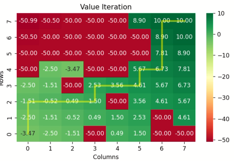
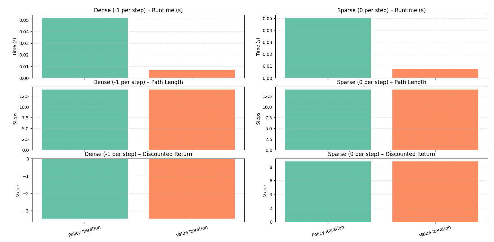

# AR525-RL Assignment 1: Grid Navigation using Dynamic Programming

## Overview
The goal of this assignment is to implement Dynamic Programming algorithms for robotic path planning. You will implement **Policy Iteration** and **Value Iteration** to compute optimal policies for navigating a UR5 robotic manipulator on a grid world with obstacles.

## Simulation Environment
The simulation environment uses **PyBullet** for 3D visualization and realistic physics simulation. The UR5 manipulator navigates on a 5x6 grid with randomly placed obstacles.

<p align="center">
  
</p>

## Prerequisites
- Python 3.8 or higher
- pip (Python package installer)

## Setup Instructions

### 1. Clone or Download the Repository
Download the project files to your local machine.

### 2. Install Dependencies
Navigate to the project directory and install the required packages:

```bash
cd AR525-RL/a1
pip install -r requirements.txt
```

The `requirements.txt` includes:
- numpy
- matplotlib
- seaborn
- pybullet

### 3. (Optional) Create a Virtual Environment
It's recommended to use a virtual environment to avoid conflicts with other Python projects.

```bash
python -m venv venv
# On Windows:
venv\Scripts\activate
# On macOS/Linux:
source venv/bin/activate
```

Then install dependencies as above.

## Workflow

### Step 1: Understand the Environment
- **States**: 30 states (5 rows × 6 columns), numbered 0-29
- **Actions**: 4 actions (LEFT=0, DOWN=1, RIGHT=2, UP=3)
- **Start**: State 0 (top-left corner)
- **Goal**: State 29 (bottom-right corner)
- **Obstacles**: Randomly placed, terminal states with negative reward

### Step 2: Implement DP Algorithms
Implement the following functions in `utils.py`:

1. **Policy Evaluation**: Evaluate a given policy using iterative updates.
2. **Q-value Computation**: Compute Q(s,a) from V(s).
3. **Policy Improvement**: Derive a greedy policy from V(s).
4. **Policy Iteration**: Alternate evaluation and improvement until convergence.
5. **Value Iteration**: Directly optimize V(s) using Bellman optimality.

### Step 3: Test Your Implementation
Run the simulation to verify your algorithms:

```bash
python main.py
```

This will:
- Load the grid environment
- Compute optimal policy using your DP algorithms
- Visualize the UR5 robot navigating the optimal path
- Display value function heatmaps
- Show the end-effector trajectory

### Step 4: Analyze and Compare
- Compare Policy Iteration vs Value Iteration performance
- Analyze convergence speed and path quality
- Experiment with different reward structures

## Exercises
The assignment has **5 core exercises**:

### Part 1: Policy Evaluation
Implement `policy_evaluation(env, policy, gamma=0.99, theta=1e-8)` using the Bellman expectation equation.

### Part 2: Q-value Computation
Implement `q_from_v(env, V, s, gamma=0.99)` to compute action-values from state-values.

### Part 3: Policy Improvement
Implement `policy_improvement(env, V, gamma=0.99)` to derive a greedy policy.

### Part 4: Policy Iteration
Implement `policy_iteration(env, gamma=0.99, theta=1e-8)` by alternating evaluation and improvement.

### Part 5: Value Iteration
Implement `value_iteration(env, gamma=0.99, theta=1e-8)` using the Bellman optimality equation.

### Part 6: Unseen Environment
Your code will be tested on different grid configurations to evaluate robustness.

## Code Structure

```
AR525-RL/a1/
├── main.py              # Main simulation script
├── utils.py             # DP algorithm implementations
├── requirements.txt     # Python dependencies
├── assets/              # 3D models and URDF files
│   ├── ur5.urdf
│   ├── end_effector.urdf
│   ├── robot_stand.urdf
│   ├── cube_and_square/
│   ├── meshes/ur5/
│   └── table/
└── README.md            # This file
```

## Deliverables

- **Completed Code**: All DP algorithms implemented in `utils.py`
- **Simulation Demo**: Robot navigation with optimal path visualization
- **Analysis Report**: Comparison of algorithms, convergence analysis, insights

## Results

### Simulation Environment
<p align="center">
  
</p>

### Value Function Heatmaps

#### Policy Iteration
<p align="center">
  
</p>

#### Value Iteration
<p align="center">
  
</p>

### Robot Navigation Demo
<p align="center">
  
</p>

### Analysis
<p align="center">
  
</p>

For detailed results and videos, see `Policy_Iteration.mp4` and `value Iteration.mp4`.

## Tips and Troubleshooting

- **Start Simple**: Test on smaller grids first
- **Debug Values**: Print V[start] and V[goal] to check convergence
- **Convergence Issues**: Ensure gamma < 1.0 and proper theta threshold
- **Robot Not Moving**: Verify optimal path is computed and IK is working
- **Obstacles**: Basic implementation treats obstacles as terminal states

## References

- Sutton & Barto, "Reinforcement Learning: An Introduction" (Chapter 4)
- [OpenAI Spinning Up - Dynamic Programming](https://spinningup.openai.com/en/latest/spinningup/rl_intro.html)


**Good luck! 🚀**

## Work Credits
- **[Amar Chandra](https://github.com/)** — PhD CAIR, IIT Mandi 
- **[Harsh Vardhan Saxena](https://github.com/)** — M.Tech.(R) CAIR, IIT Mandi
- **[Ayush Vaidande](https://github.com/THEIOTGUY)** — M.Tech.(R) CAIR, IIT Mandi

## Acknowledgements
Thanks to Jagannath Prasad Sahoo and Dharmendra Sharma for preparing this assignment.